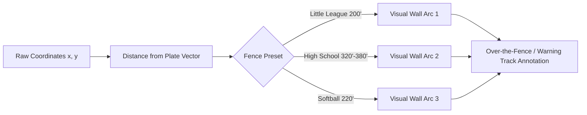

# Pinch Hitter — Pro Tier Strategy, Feature Gating & Analytics Roadmap

This document outlines the strategic, functional, and visual planning for introducing a **Pro subscription or license tier** to Pinch Hitter.

---

## 1. Architectural Foundation: Method-Agnostic Entitlements

The implementation of feature gating must remain completely decoupled from the payment method or provider (Stripe, LemonSqueezy, In-App Purchases, cryptographic offline license keys, or organizational team vouchers).

```mermaid
flowchart TD
    subgraph UI ["Application Components & Guards"]
        A[PracticeComponent]
        B[ReportsComponent]
        C[SettingsComponent]
        D[Router Feature Guards]
    end

    subgraph Core ["Entitlement Engine (Method-Agnostic)"]
        E[EntitlementService]
        F[IndexedDB License Store]
    end

    subgraph Adapters ["Pluggable License Providers (ILicenseProvider)"]
        G[Stripe Customer Portal Adapter]
        H[Offline Cryptographic Key Adapter]
        I[School / Org Site License Adapter]
        J[Local Dev / Mock Adapter]
    end

    A -->|canAccess(feature)| E
    B -->|isPro()| E
    C -->|licenseStatus()| E
    D -->|canActivate()| E
    E <-->|cache / read| F
    E <-->|verify & refresh| G
    E <-->|verify offline signature| H
    E <-->|validate org token| I
    E <-->|debug override| J
```

### 1.1 Entitlement Service Contract

```typescript
export type FeatureId =
  | 'multi_team'
  | 'custom_field_dimensions'
  | 'multi_player_comparison'
  | 'advanced_time_series'
  | 'scout_pdf_export'
  | 'enriched_csv_metrics'
  | 'custom_heat_bandwidth';

export type CoachTier = 'free' | 'pro' | 'organization';

export interface LicenseStatus {
  tier: CoachTier;
  active: boolean;
  expiresAt: string | null; // ISO 8601 or null for lifetime
  licenseeEmail?: string;
  source: 'stripe' | 'license_key' | 'organization' | 'free';
  offlineValidUntil?: string; // Grace period for offline PWA
}

export interface EntitlementService {
  readonly status: Signal<LicenseStatus>;
  readonly isPro: Signal<boolean>;
  canAccess(feature: FeatureId): boolean;
  activateWithKey(keyString: string): Promise<{ success: boolean; error?: string }>;
  openCustomerPortal(): Promise<void>;
  deactivateLicense(): Promise<void>;
}
```

### 1.2 Offline-First PWA Licensing Models

Because Pinch Hitter is an offline-capable PWA used on baseball fields without reliable cellular connections, gating cannot rely on blocking server roundtrips during batting practice:

1. **Option 1: Cryptographic Signed License Keys (Offline-Verifiable)**:
   - A coach buys a license on a Stripe Checkout page.
   - The webhook generates a cryptographically signed payload (e.g., Ed25519 or HMAC-SHA256 signature containing email, expiration date, and tier).
   - The coach enters or pastes the license string into Pinch Hitter.
   - The browser verifies the cryptographic signature locally against a bundled public key with **zero server dependencies**. Works 100% offline indefinitely or until expiration.
2. **Option 2: Token with Offline Grace Period**:
   - For recurring subscriptions managed through Stripe Customer Portal, the browser fetches an entitlement token when online.
   - The token is cached in IndexedDB with an `offlineValidUntil` timestamp (e.g., 30–60 days).
   - The coach can coach offline uninterrupted; Pinch Hitter refreshes validity whenever an internet connection is available.

---

## 2. Feature-by-Feature Pros & Cons and Gating Analysis

A successful freemium model must achieve two simultaneous goals:

1. **Preserve the magic of the core free product** so coaches love it, use it every practice, and recommend it to fellow coaches.
2. **Offer clear, high-leverage power tools** for serious coaches, travel programs, high schools, and academies that justify paying for Pro.

### Gating Evaluation Matrix

| Existing Feature                            | Proposed Tier | Pros of Gating                                                                                              | Cons of Gating                                                                    | Strategic Recommendation                                                                  |
| :------------------------------------------ | :-----------: | :---------------------------------------------------------------------------------------------------------- | :-------------------------------------------------------------------------------- | :---------------------------------------------------------------------------------------- |
| **Field Tap & Whiff Capture**               |   **Free**    | Immediate monetization of the primary interaction.                                                          | Destroys the core utility of the app. Coaches will abandon the app immediately.   | **Keep 100% Free**. Never limit contacts or rounds.                                       |
| **Rotation Queue & Undo**                   |   **Free**    | Core practice efficiency feature.                                                                           | Makes batting practice frustrating if locked.                                     | **Keep 100% Free**. Essential for field flow.                                             |
| **JSON Backup & Import**                    |   **Free**    | Could force coaches to pay to preserve their data.                                                          | Betrays the "Your notebook belongs to you" promise. Damaging to trust.            | **Keep 100% Free**. Data sovereignty is non-negotiable.                                   |
| **Roster Size & Player Profiles**           |   **Free**    | Easy to cap (e.g. limit to 9 or 12 players).                                                                | Real baseball rosters have 12–20 players. An arbitrary roster cap feels petty.    | **Keep Free for standard roster**. Unlimited players per team.                            |
| **Teams & Multi-Team Seasons**              |  **Tiered**   | Very high value: Travel ball coaches manage 2–4 teams; high school coaches manage Varsity + JV.             | Single-team recreational coaches are untouched. Clear organizational distinction. | **Free: 1 Active Team**.<br>**Pro: Unlimited Teams & Multi-Season Archives**.             |
| **Standard Spray Chart & Heatmap**          |   **Free**    | High visual appeal drives free coach satisfaction.                                                          | None; essential for the product to be useful.                                     | **Keep Free (Standard Field & 12x12 Heatmap)**.                                           |
| **Custom Field Dimensions & Fences**        |    **Pro**    | Elite high-school/college appeal; requires tailored diamond dimensions.                                     | Advanced feature; casual coaches don't need custom outfield fences.               | **Gate to Pro**.                                                                          |
| **Standard Filters (Season, Today, 7d)**    |   **Free**    | Everyday practice review needs basic date filters.                                                          | None.                                                                             | **Keep Free**.                                                                            |
| **Advanced Cross-Filters & Custom Dates**   |    **Pro**    | Deep statistical mining; power coaches comparing specific road vs home sessions.                            | Casual coaches are satisfied with preset date buttons.                            | **Gate to Pro** (or Keep basic custom date free, gate multi-session comparative filters). |
| **Directional Tendencies & Pitcher Splits** |   **Free**    | Fundamental coaching feedback (Pull/Oppo and RHP/LHP).                                                      | Differentiates Pinch Hitter from blank paper notebooks.                           | **Keep Free**.                                                                            |
| **Multi-Player Comparison Overlay**         |    **Pro**    | Extremely powerful for coaches setting lineups or comparing 2 hitters on one chart.                         | Complex analytical feature; high willingness to pay.                              | **Gate to Pro**.                                                                          |
| **14-Day vs. Season Progress Table**        |   **Free**    | Instant reinforcement that the app provides coaching value.                                                 | None.                                                                             | **Keep Free**.                                                                            |
| **Rolling Trend Curves (Time-Series)**      |    **Pro**    | Visual charts showing whiff rate and hard-hit trends over 30/60/90 days.                                    | High engineering and visual value. Serious player development coaches want this.  | **Gate to Pro**.                                                                          |
| **Flat CSV Event Export**                   |   **Free**    | Raw data export honors data ownership.                                                                      | Hard to gate without violating data sovereignty principles.                       | **Keep Free** (Standard raw event CSV).                                                   |
| **Enriched Analytics CSV & Excel Model**    |    **Pro**    | Formatted spreadsheets with pre-calculated pivot tables, exit metrics, and launch angles.                   | Geared toward analytics coordinators and college recruiters.                      | **Gate to Pro**.                                                                          |
| **Browser Print / Standard PDF**            |   **Free**    | Basic browser print of current screen.                                                                      | Standard browser feature.                                                         | **Keep Free**.                                                                            |
| **Custom Branded Scout Cards (PDF)**        |    **Pro**    | Professional one-page player dossiers with team logo, spray chart, heat zone, and notes for scouts/parents. | High visual prestige. High school and travel coaches will happily pay.            | **Gate to Pro**.                                                                          |

---

## 3. Visual Free vs. Pro Matrix

```
┌───────────────────────────────────────────────┬──────────────────────┬──────────────────────┐
│ Capability                                    │     FREE COACH       │      PRO COACH       │
├───────────────────────────────────────────────┼──────────────────────┼──────────────────────┤
│ Live Batting Practice Capture                 │      Unlimited       │      Unlimited       │
│ Whiff & Contact Quality Scale (0–5)           │          ✓           │          ✓           │
│ 100-Step Reversible Undo                      │          ✓           │          ✓           │
│ Voice Recognition Hitter Search               │          ✓           │          ✓           │
│ Full JSON Backup & Merge Across Devices       │          ✓           │          ✓           │
│ Offline PWA Support                           │          ✓           │          ✓           │
│ Active Teams                                  │       1 Team         │   Unlimited Teams    │
│ Multi-Season Archives                         │    Current Only      │      Unlimited       │
│ Standard Spray Chart & 12x12 Density Grid     │          ✓           │          ✓           │
│ Custom Field Dimensions (Fence Distances)     │          ─           │          ✓           │
│ Defensive Shift & Positioning Zones           │          ─           │          ✓           │
│ Multi-Hitter Comparative Spray Chart          │          ─           │          ✓           │
│ Rolling 30/60-Day Development Trend Curves    │          ─           │          ✓           │
│ Directional Tendencies & Pitcher Splits       │          ✓           │          ✓           │
│ Raw Flat CSV Export                           │          ✓           │          ✓           │
│ Enriched Analytics CSV + Excel Pivot Model    │          ─           │          ✓           │
│ Standard Browser Print                        │          ✓           │          ✓           │
│ Executive Scout Cards & Branded PDF Dossiers  │          ─           │          ✓           │
└───────────────────────────────────────────────┴──────────────────────┴──────────────────────┘
```

### 3.1 Visual In-App Gating Experience ("The Elegant Pro Badge")

Gating in Pinch Hitter should feel respectful and informative—never like an aggressive popup paywall during live practice:

```
┌────────────────────────────────────────────────────────────────────────┐
│  Reports · Westfield Wildcats                                          │
├────────────────────────────────────────────────────────────────────────┤
│  [Spray View]  [Heat View]  [History View]  [Compare Hitters ✦ PRO]    │
│                                                                        │
│  ┌──────────────────────────────────────────────────────────────────┐  │
│  │                                                                  │  │
│  │                     [ SPRAY CHART FIELD ]                        │  │
│  │                                                                  │  │
│  └──────────────────────────────────────────────────────────────────┘  │
│                                                                        │
│  ┌──────────────────────────────────────────────────────────────────┐  │
│  │ ✦ PRO FEATURE: CUSTOM FIELD WALLS                                │  │
│  │ Set exact outfield fence distances (e.g. 315' LF, 380' CF) to    │  │
│  │ see which fly balls clear the wall on your home field.           │  │
│  │ [Preview with Demo Field]  [Unlock Pro Coach →]                  │  │
│  └──────────────────────────────────────────────────────────────────┘  │
└────────────────────────────────────────────────────────────────────────┘
```

- **Interactive Previews**: When a free coach taps a Pro feature (such as custom fence dimensions or multi-player comparison), the app shows a visual preview or demo toggle rather than a dead-end error.
- **Never Interrupt Live Practice**: Live practice mode is distraction-free; pro upsells only appear in deep reporting, export customization, or team switching.

---

## 4. Future "Beefy" Pro Analytics Roadmap (Charting & Visualizations)

Here are the six major analytical and visualization capabilities designed for the Pro tier:

### 4.1 Customizable Outfield Dimensions & Fence Markers

- **The Problem**: A 280-foot fly ball is an out at a high school field, but a grand slam on a Little League or 12U diamond.
- **Pro Solution**:
  - Outfield fence overlay on the SVG diamond with preset distances:
    - _Little League / Youth_: 200 ft uniform.
    - _High School / Travel_: 315 ft (lines), 365 ft (alleys), 390 ft (center).
    - _College / Pro_: 330 ft (lines), 375 ft (alleys), 405 ft (center).
    - _Fastpitch Softball_: 220 ft uniform.
    - _Custom Wall_: Draggable control points matching the coach's actual home field.
  - Automatic calculation of "Warning Track" vs "Home Run" balls based on distance from home plate `(0.50, 0.88)`.



### 4.2 Defensive Shift & Positioning Heat Zones

- **Visual Overlay**: Shaded polygonal zones for:
  - _Infield Shift_: Extreme pull-side infield coverage vs standard depth.
  - _Outfield Depth_: Shallow ("no doubles") vs deep fence defense.
  - _Gap Coverage_: Left-center and right-center alleys.
- **Actionable Metric**: "Opponents can take away 42% of Tyler's ground balls by shading the shortstop 8 feet toward second base."

### 4.3 Multi-Player & Split Comparative Spray Charts

- Overlay two hitters on the same field simultaneously:
  - Blue dots for _Player A_, Gold dots for _Player B_.
  - Useful for comparing two contenders for the clean-up spot or leadoff role.
- **Switch-Hitter Split Overlay**: View a switch-hitter's Left-handed batting contacts superimposed over their Right-handed batting contacts with distinct color plots.

### 4.4 Advanced Time-Series Trend Curves

- **Rolling Contact Quality Index**: A moving-average line chart across practices plotting the percentage of Solid/Hard/Crushed balls (ratings 3–5).
- **Whiff Rate Evolution**: Tracking swing-and-miss percentage over the course of a 10-week season or off-season batting program.
- **Pull-Power Trajectory**: Measuring whether a hitter's pull-side power is improving as mechanics adjust.

### 4.5 Estimated Launch Vector & Exit Metric Modeling

- By combining landing coordinates with trajectory classification (`line-drive`, `fly-ball`, `ground-ball`, `pop-up`) and contact quality (`1`–`5`), Pinch Hitter can derive estimated launch angles and exit velocity bands without requiring expensive radar hardware.

### 4.6 Executive Scout Cards & Branded PDF Dossiers

- One-page downloadable PDF dossier designed for college recruitment, showcase submission, or end-of-season player awards:
  - Team logo and custom colors.
  - Player profile, jersey number, positions, academic class.
  - High-resolution spray chart and density heatmap.
  - Pull/Center/Oppo radar chart.
  - Coach's qualitative scouting notes.

---

## 5. Accessibility & Ergonomics (Universal Design)

These display and ergonomic settings are built into the baseline application.

### 5.1 Color-Blind Safe Modes (Solving Red-on-Green on the Diamond)

- **The Challenge**: A baseball diamond is naturally rendered as a green turf/grass surface (`--green: #235d42`). Standard baseball charts frequently use red dots for outs or hard-hit balls. For coaches with red-green color vision deficiency (deuteranopia or protanopia, affecting ~8% of men), red markers on green grass are nearly invisible or blend into muddy brown.
- **The Solution**:
  1. **Color-Blind Safe Palette**: Provide an optional color palette toggle (Settings → Display) utilizing mathematically proven accessible color scales (such as Okabe-Ito):
     - Line drives: Bright Cyan / Sky Blue (`#56B4E9`)
     - Fly balls: Vivid Yellow (`#F0E442`)
     - Ground balls: Dark Charcoal / Slate (`#000000` / `#4B5563`)
     - Pop-ups: Purple / Reddish Purple (`#CC79A7`)
     - Bunts: Bright Orange (`#E69F00`)
  2. **Multi-Shape Markers (Redundant Encoding)**:
     - Never rely on color alone to communicate data.
     - Out vs. Hit, or Trajectory classifications can use distinctive SVG glyphs:
       - Circle: Standard hit / contact
       - Cross / X: Out
       - Diamond: Extra base hit
       - Square: Hard-hit ball
  3. **High-Contrast Field Surface**:
     - Toggle between "Classic Ballpark Green" and "High-Contrast Monochrome / Blueprint Field" (slate/cream line art with maximized dot contrast under bright outdoor sunlight).

### 5.2 Left-Handed Dugout Mode (One-Handed Mobile Ergonomics)

- **Why It Makes Enormous Sense on Mobile**:
  - In a live batting practice environment, a coach rarely operates a phone with two hands. One hand is holding a fungo bat, a bucket of baseballs, a radar gun, or leaning against the cage fence.
  - For left-handed coaches holding the phone in their left hand:
    - Reaching the bottom-right **"Next batter →"** primary action button requires awkward thumb strain across a 6.1"–6.7" smartphone screen.
    - Accidental taps on "Undo last" (bottom-left) can occur when reaching across.
- **The Implementation**:
  - **Action Bar Mirroring**:
    - Right-Handed (Default): `[ ↶ Undo last ] [ Skip ] [ Next batter → (Primary) ]`
    - Left-Handed Mode: `[ ← Next batter (Primary) ] [ Skip ] [ Undo last ↷ ]`
  - **Thumb-Zone Controls**:
    - The most frequent action ("Next batter") is pinned directly under the left thumb.
    - Switch-hitter side toggle (`Left / Right`) and pitcher hand toggle (`RHP / LHP`) align to the left rail for immediate one-thumb tapping.
  - **Quick Dugout Toggle**: Accessible in Settings or via a fast one-tap icon in the practice header.

---

## 6. Master Implementation Roadmap & TODO Tracker

This checklist serves as the authoritative implementation tracker across future development phases:

### Phase A: Accessibility & Dugout Ergonomics

- [x] **TODO-A1: Color-Blind Palette Setting** (Completed):
  - Added `colorPalette` (`'standard' | 'colorblind' | 'high_contrast'`) and `shapeMarkers` in `AppSettings` and `CoachStore`.
  - Updated `FieldComponent` SVG dot coloring to use accessible Okabe-Ito color mapping with blue-to-yellow CVD heatmaps.
  - Added geometric multi-shape marker glyphs (circles, diamonds, triangles, stars, crosses, squares) so color is never the sole information carrier (WCAG 1.4.1).
  - Synchronized spray chart legend in `ReportsComponent` with corresponding shape glyphs and CVD colors.
- [x] **TODO-A2: High-Contrast Field Background** (Completed):
  - Added `fieldTheme` (`'classic' | 'high_contrast'`) in `AppSettings` and `CoachStore`.
  - Implemented High-Contrast Slate field theme in `FieldComponent` with deep obsidian canvas (`#0f172a`), 5px bright white chalk foul lines, pure white bases, and high-visibility labels to eliminate outdoor midday glare.
  - Added on-field quick toggles in `⚙ Practice options` and dedicated controls in `Settings → Visual Accessibility & Display`.
- [x] **TODO-A3: Left-Handed Dugout Mode** (Completed):
  - Added `leftHandedMode` in `AppSettings` and `CoachStore` preferences.
  - Mirrored bottom action footer in `PracticeComponent` (placed "Next Batter" in left thumb zone, "Undo" to right).
  - Mirrored queue manipulation chips and pitcher/hitter toggles for left-hand reach.
  - Added on-field quick toggle in `⚙ Practice options` and persistent setting in `Settings → Practice defaults`.

### Phase B: "Beefy" Pro Analytics & Visualizations

- [ ] **TODO-B1: Custom Outfield Fence Distances**:
  - Overlay outfield fence distance arcs onto the SVG diamond (`field.component.ts`).
  - Add presets: Little League (200'), High School (320'–390'), College (330'–405'), Softball (220'), and Custom distance points.
  - Calculate distance vectors from home plate `(0.50, 0.88)` and annotate warning-track/homerun balls.
- [ ] **TODO-B2: Multi-Player & Switch Split Spray Overlay**:
  - Add "Compare Hitters" view in `ReportsComponent`.
  - Superimpose two hitters with dual-color palette (e.g. Electric Blue vs Sunburst Gold).
  - Support switch-hitter L vs R comparative overlay on the same diamond.
- [ ] **TODO-B3: Rolling Development Trend Curves**:
  - Create time-series line chart component tracking 30/60-day moving averages of hard-hit rate and whiff percentage across practices.
- [ ] **TODO-B4: Defensive Shift & Coverage Zones**:
  - Add visual polygon overlays representing standard vs shifted defensive positions.

### Phase C: In-App Gating UI & Previews

- [ ] **TODO-C1: Subtle `✦ PRO` UI Badges**:
  - Add non-intrusive badge components to Pro features in Reports and Settings.
- [ ] **TODO-C2: Interactive Pro Preview Modes**:
  - Allow free coaches to preview custom fence overlays and multi-player comparisons using sample/demo data without hard errors.
- [ ] **TODO-C3: Upgrade & License Modal / Sheet**:
  - Add an accessible dialog explaining Pro Coach features, with "Enter License Key" and "Upgrade" actions.

### Phase D: Payment & Licensing Integrations

- [ ] **TODO-D1: Cryptographic Offline License Key Provider**:
  - Implement client-side Ed25519/HMAC signature verification for offline PWA license keys.
- [ ] **TODO-D2: Stripe Checkout / Webhook Integration**:
  - Set up Stripe Customer Portal link and webhook-driven license key generator.
- [ ] **TODO-D3: School & Organization License Provider**:
  - Multi-coach licensing for high school athletic departments and travel clubs.

### Phase E: Export & Scouting Enhancements

- [ ] **TODO-E1: Executive Branded Scout Cards (PDF)**:
  - High-res one-page player evaluation sheet with team crest, spray chart, heat zone, radar tendencies, and coach notes.
- [ ] **TODO-E2: Enriched Analytics CSV Export**:
  - Flat CSV with calculated distance, launch angles, and exit velocity bands.
