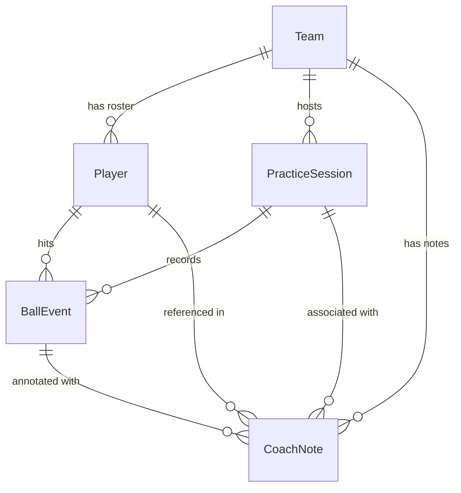

# Pinch Hitter — Technical Architecture & Project Overview

Pinch Hitter is an offline-first, client-side baseball and softball batting-practice notebook and spray chart designed for coaches. It is built as a modern Angular Progressive Web Application (PWA) running locally in the browser with **zero server backend, zero accounts, and zero third-party tracking**.

---

## 1. Core Architectural Principles

### 1.1 Local-First Data Sovereignty ("Your Notebook Belongs to You")

- **Primary Data Store**: Browser-native IndexedDB (`pinch-hitter` database).
- **Zero Cloud Leakage**: All teams, rosters, practices, ball events, and notes reside strictly on the coach's local device.
- **Portable Backups**: Full canonical JSON backup with strict validation, conflict resolution, and deterministic merging.
- **Analysis-Ready Export**: Flat CSV event exports formatted for spreadsheets, R, Python, and external analytics tools.

### 1.2 Offline-Native Operation

- Complete PWA installation via Web App Manifest and Service Worker caching (`@angular/service-worker`).
- Works seamlessly in remote fields, dugouts, and facilities with spotty or nonexistent cellular connections.
- Storage persistence requested via the browser's `navigator.storage.persist()` API to safeguard IndexedDB against eviction under disk pressure.

### 1.3 Strict Transactional Integrity & Concurrency

- **Multi-Tab Synchronization**: Uses the Web Locks API (`navigator.locks.request`) to coordinate read/modify/write transactions across multiple browser tabs.
- **Revision Tokens**: In environments where Web Locks are unavailable, atomic revision comparisons inside IndexedDB transactions detect concurrent edits and retry safely up to two times.
- **Atomic Capture**: When a ball event is recorded, the event record, the practice session turn/queue state, and the revision metadata are written together in a **single atomic IndexedDB transaction**. Signals in the UI update only _after_ the transaction successfully commits.

---

## 2. Technology Stack

| Layer                    | Technology                 | Details                                                                       |
| :----------------------- | :------------------------- | :---------------------------------------------------------------------------- |
| **Framework**            | Angular 22 (Standalone)    | Signal-based reactive state, zoneless change detection patterns               |
| **Language**             | TypeScript 6.0+            | Strict typing, immutable domain transformations                               |
| **Styling**              | Native CSS & SCSS          | System font stack, responsive layouts, native SVG rendering                   |
| **Storage**              | Native IndexedDB           | Object stores for teams, players, sessions, events, notes, settings, metadata |
| **PWA / Service Worker** | `@angular/service-worker`  | Offline caching, background updates                                           |
| **Tooling & Test**       | Vitest, Playwright, ESLint | Unit tests, cross-viewport touch E2E tests, PWA offline test suite            |

---

## 3. Domain Model & Schema

All domain entities extend a standard timestamped contract:

```typescript
interface Entity {
  id: string; // Stable UUID generated via crypto.randomUUID()
  createdAt: string; // ISO 8601 UTC timestamp
  updatedAt: string; // ISO 8601 UTC timestamp
}
```



### 3.1 Entity Specifications (`src/app/data/models.ts`)

- **`Team`**:
  - `name`: Full team display name (e.g., "Westfield Wildcats").
  - `shortName`: Abbreviated moniker (e.g., "WILDCATS").
  - `season`: Text label (e.g., "Spring 2026") supporting varied league schedules.
  - `logoUrl`: Optional custom emblem/logo stored as an inline image (data URL).
  - `notes`: General team-level coaching notes.

- **`Player`**:
  - `teamId`: Foreign key to `Team`.
  - `name`: Full player name.
  - `jerseyNumber`: String (preserving values like `"00"` or `"#7"`).
  - `bats`: Handedness (`'R'`, `'L'`, or `'S'` for switch).
  - `throws`: Handedness (`'R'`, `'L'`, or `'S'`).
  - `positions`: String array (e.g., `["SS", "2B", "CF"]`).
  - `grade`: Optional school/age grade.
  - `order`: Numeric default batting lineup position.
  - `active`: Boolean flag; archiving retains all historical stats and events without deletion.

- **`PracticeSession`**:
  - `teamId`: Foreign key to `Team`.
  - `startedAt` / `endedAt`: Practice timing.
  - `title`: Optional custom title (e.g., "BP vs Fastball Machine").
  - `location`: Field or facility name.
  - `participantIds`: IDs of players attending today's practice.
  - `queue`: Active batting rotation queue (`string[]` of player IDs; index 0 is currently at bat).
  - `currentTurn`: 1-based turn counter across the practice.
  - `turnContacts`: Count of recorded contacts in the current turn.
  - `nextSequence`: Monotonically increasing sequence number for event ordering.
  - `rotationCount`: `null` for manual hitter advancement, or positive integer (e.g., 3, 5, 8) for automatic rotation.
  - `pitcherHand`: Current active pitcher hand (`'R'` or `'L'`).
  - `undoStack`: Array of the latest 100 reversible actions containing `before` and `after` turn states.

- **`BallEvent`**:
  - Authoritative snapshot of a batted-ball observation:
    - Coordinates: `fieldX` and `fieldY` (normalized `0.0` to `1.0`).
    - Handedness snapshots: `pitcherHand` (`'R'`, `'L'`) and `batterSide` (`'R'`, `'L'`).
    - Classifications: `contactType` (`'fly-ball'`, `'line-drive'`, `'ground-ball'`, `'pop-up'`, `'bunt'`), `result` (`'out'`, `'single'`, `'double'`, `'triple'`, `'home-run'`, `'error'`, `'foul'`, `'sacrifice'`), and `hardHit` rating (`0` = whiff, `1`–`5` = contact quality).
    - Player snapshots: `playerName` and `jerseyNumber` are snapshotted at capture time so subsequent roster changes never alter historical records.

- **`CoachNote`**:
  - Scoped coaching notes attached to a team, player, session, or specific ball event.

- **`AppSettings`**:
  - Singleton settings record managing application preferences and dugout configurations:
    - `activeTeamId`: ID of the currently selected active team.
    - `defaultPitcherHand`: Baseline pitcher handedness (`'R'` or `'L'`) for new sessions.
    - `rotationCount`: `null` for manual hitter advancement, or positive integer (e.g., 3, 5) for automatic rotation.
    - `leftHandedMode`: Boolean dugout ergonomic flag that mirrors the action rail, placing "Next batter" under the left thumb and shifting pitcher/queue controls to the left edge.
    - `colorPalette`: Color spectrum mode (`'standard'`, `'colorblind'` using Okabe-Ito barrier-free palette, or `'high_contrast'`).
    - `fieldTheme`: Field canvas theme (`'classic'` green turf or `'high_contrast'` obsidian slate `#0f172a` for intense outdoor sunlight).
    - `shapeMarkers`: Boolean enabling redundant geometric SVG marker glyphs (circles, diamonds, triangles, stars, crosses, squares) per WCAG 1.4.1.

---

## 4. Field Coordinate Surface & Mathematics

Pinch Hitter uses a normalized, resolution-independent coordinate system (Version 1):

```
(0, 0) Top-Left ───────────────────────────── (1.0, 0)
 │                                                │
 │                  Center Field                  │
 │                  (0.50, 0.08)                  │
 │                       │                        │
 │         Left          │         Right          │
 │        Field          │         Field          │
 │                       │                        │
 │                   2nd Base                     │
 │                 (0.50, 0.60)                   │
 │             ◇                   ◇              │
 │          3rd Base            1st Base          │
 │        (0.36, 0.74)        (0.64, 0.74)        │
 │                       ◇                        │
 │                   Home Plate                   │
 │                  (0.50, 0.88)                  │
 │                                                │
(0, 1.0) ──────────────────────────────────── (1.0, 1.0)
```

- **Origin**: `(0, 0)` is the top-left of the square SVG viewBox (`0 0 1000 1000`).
- **Normalized Units**: `fieldX = svgX / 1000`, `fieldY = svgY / 1000`. Both bounded in `[0.0, 1.0]`.
- **Home Plate Anchor**: Exactly centered at `(0.50, 0.88)`.
- **Directional Calculations**:
  $$\theta = \text{atan2}(\text{fieldX} - 0.50, 0.88 - \text{fieldY}) \times \frac{180}{\pi}$$
  - Center field zone: $|\theta| \le 15^\circ$.
  - For Right-Handed Hitters: $\theta < -15^\circ$ is **Pull**, $\theta > 15^\circ$ is **Opposite**.
  - For Left-Handed Hitters: $\theta > 15^\circ$ is **Pull**, $\theta < -15^\circ$ is **Opposite**.
- **Density Grid**: Derived in-memory using a bounded $12 \times 12$ bin matrix normalized to the maximum bin count, providing heat density without external rendering dependencies.

---

## 5. Application Structure & Component Map

```
src/app/
├── app.config.ts             # Application providers (Router, Service Worker)
├── app.routes.ts             # Route definitions with standalone lazy loading
├── app.ts / app.html         # Shell layout, global navigation & team status
│
├── data/                     # Core Domain & Data Layer
│   ├── models.ts             # Entity interfaces, constants, and type definitions
│   ├── domain.ts             # Pure functions: queue math, coordinates, summaries, filters
│   ├── repository.ts         # Native IndexedDB driver, schema upgrades, transaction handling
│   ├── coach-store.ts        # Signal-based centralized store & serialized state mutations
│   ├── entitlement.service.ts # Method-agnostic feature authorization & simulation tier
│   └── transfer.ts           # JSON canonical backup/merge, CSV parsing & export
│
├── home/                     # Home Dashboard
│   └── home.component.ts     # Welcome onboarding, active session hero, backup indicators
│
├── roster/                   # Roster Management
│   └── roster.component.ts   # Player CRUD, order reordering, bulk text/CSV import
│
├── practice/                 # Batting Practice Workspace
│   ├── practice.component.ts # Live capture orchestration, speech recognition, sheets
│   ├── practice.component.html # Field interaction, classification buttons, queue strip
│   └── practice.component.scss # High-contrast dugout styling, left-hand mirroring, touch targets
│
├── reports/                  # Analytics & Reports
│   ├── reports.component.ts  # Filtering signals, distributions, bulk event management
│   ├── report-analytics.ts   # 14-day comparison math, date range bounds, formatters
│   └── reports.component.html # Spray charts, heatmaps, breakdowns, print layout
│
├── settings/                 # Settings & Data Management
│   └── settings.component.ts # Team switcher, defaults, visual accessibility, storage, tier simulator
│
├── shared/                   # Reusable UI & Utilities
│   ├── field.component.ts    # Normalized SVG diamond: Okabe-Ito colors, shape markers, slate theme
│   ├── modal.directive.ts    # Accessible native dialog wrapper
│   ├── install.service.ts    # PWA install prompt handler
│   └── files.ts              # Native Web Share API & download triggers
```

### 5.1 Feature Entitlement & Authorization Architecture

Pinch Hitter uses a method-agnostic authorization gateway (`EntitlementService` in `src/app/data/entitlement.service.ts`):

- **Zero-Config Default**: Out of the box, `EntitlementService` defaults to fully unlocked (`pro`), allowing all coaches immediate access without requiring license files, logins, or environment variables.
- **Method-Agnostic Interface**: Consumers call `canAccess(feature: FeatureKey)` or read reactive signals (`tier()`, `isPro()`). The caller never knows whether an entitlement was granted via a local test toggle, a cryptographic license key, or a future payment webhook.
- **In-App Simulator Switch**: In `Settings → Pro Features Simulator`, coaches and developers can toggle between `Pro Coach` and `Free Coach` to test gated boundaries. The simulation state persists in `localStorage` (`pinch-hitter:simulated-tier`).
- **Extensible Verification Hook**: Designed to seamlessly accept future verification mechanisms (such as offline Ed25519 signature checks or Stripe webhooks) without altering application or domain logic.

### 5.2 Accessibility & Dugout Ergonomics Architecture

Pinch Hitter treats accessibility and dugout usability as baseline universal design:

- **Okabe-Ito Barrier-Free Palette**: Implemented in `FieldComponent` and `ReportsComponent`. Replaces problematic red-green pairings with scientifically validated high-contrast pigments (yellow, orange, vermilion, sky blue, reddish purple) and blue-to-yellow density heatmaps.
- **Multi-Shape Glyph Markers (WCAG 1.4.1)**: Redundant visual encoding ensures color is never the only data carrier. Batted-ball markers render as distinct geometric SVG shapes (circles, diamonds, triangles, stars, crosses, squares). The spray chart legend synchronizes with these shapes dynamically.
- **High-Contrast Slate Field (`#0f172a`)**: Designed for intense direct sunlight (midday summer games). Sharp 6px solid pure white foul lines and bright white bases ensure visibility through glare. Physical printing automatically inverts this canvas to an ink-saving line-art blueprint.
- **Left-Handed Dugout Ergonomics**: In batting practice, coaches frequently operate phones with one hand while holding equipment. `PracticeComponent` supports full mirroring of the bottom action bar (`flex: 1.5` primary "Next batter" button positioned under the left thumb) and moves pitcher and queue controls to the left rail for single-thumb reach.

---

## 6. Testing Strategy

The repository maintains an automated testing suite:

- **Unit & Domain Tests** (`*.spec.ts` via Vitest):
  - Validates turn rotation, queue jumping, deferring, and sit-outs.
  - Verifies 100-step reversible capture and automatic turn unwind.
  - Verifies normalized coordinate transformations, boundary clamping, and directional angles.
  - Tests IndexedDB migration scripts (v1 to v2) and transfer layer JSON validation/merge.
- **End-to-End Tests** (`e2e/*.spec.ts` via Playwright):
  - Multi-viewport real touch interaction: Phone portrait (390×844), Phone landscape (844×390), Tablet portrait (768×1024), Tablet landscape (1024×768), Desktop (1280×800).
  - Verifies real user journeys: team setup, roster import, live practice recording, rotation, undo, reports inspection, and CSV export.
  - PWA offline test (`playwright.pwa.config.ts`) verifies app launch and execution completely severed from the network.
